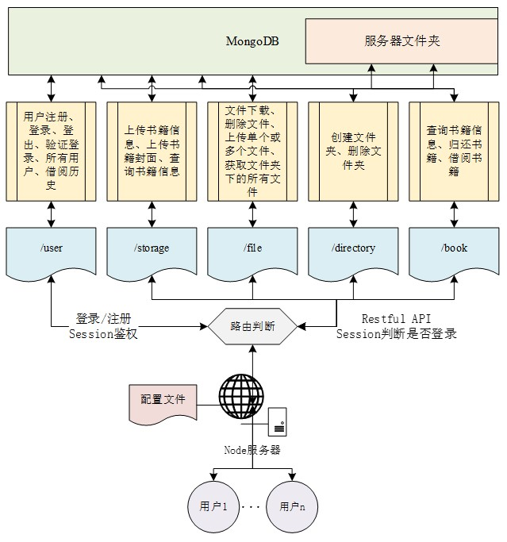
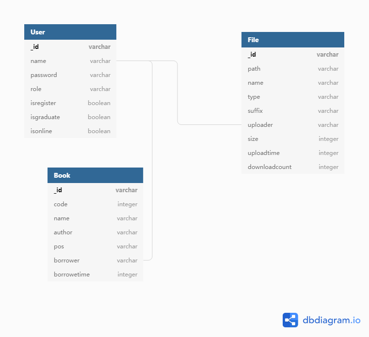
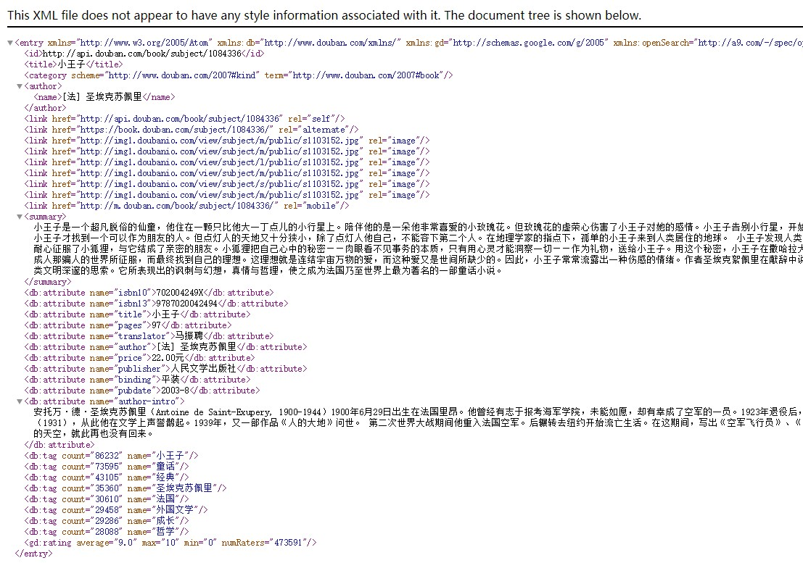
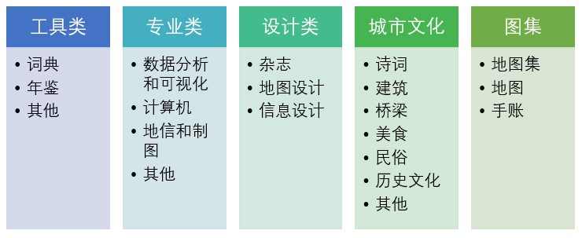

# sp-server

武大城市化研究室内网文件共享及图书管理平台服务端，架构如图所示。该服务端程序具有弱耦合、可移植性高、简单的特点，适合小型服务端搭建参考。

新用户首先需要注册，注册完成后用户需要登录。用户名和密码匹配成功会将用户名存入session表，后端统一维护已登录的用户。用户发送请求给服务器，服务器根据请求的路径做路由判断，选择不同的事务处理程序。共分为user、storage、file、directory、book五种路由，其功能如图所示。其中，file和directory会与文件系统进行交互，全部路由都与MongoDB交互。

## 技术选型
- 服务端框架：koa2.8.1
- 网络请求：axios0.19.0
- 服务端路由：koa-router7.4.0
- 服务端鉴权：koa-session5.12.3
- 服务端跨域：koa2-cors2.0.6
- 数据库：mongodb3.3.2
- 图片处理：gm1.23.1

## 相关博文
目前已在CSDN撰写7篇系列开发教程，文章目录见[这里](https://blog.csdn.net/lyandgh/article/details/104916962)

## 关键点
### 数据表设计
主要包括三个集合：Book、User和File，如图

### Session鉴权

后端需要解决判断用户是否在线的问题，解决该问题的方法有token、session等。我使用的是session鉴权的方式。其原理是：用户登录后，服务器会向用户发放session ID，存在用户浏览器的cookie中，这个cookie用户在前端是无法修改的，当用户发送请求，请求头需要带上session ID这个cookie。服务器维护一个session表，通过设置一定的时长，来管理每个用户的登录状态，超时会将该用户的session删除，这样当用户从前端发来请求，后端的session表中不存在该session ID，就会提示用户重新登录。

token的原理是用户第一次访问服务器，服务器根据用户的唯一标识（如userid），用一些加密算法（如HMAC-SHA256），通过一个密匙，生成一个令牌（token），然后用Base64编码后发送给用户。用户将这个token保存起来，以后每次请求都带上这个token，服务端收到后用密匙验证token，来判断用户是否已登录。

与token的鉴权方式不同，token是真正实现了无状态，如果服务器挂了重启依然可以判断。但是session表如果存在内存中，服务器挂了可能就会丢失用户的登录状态，因此需要考虑session持久化的问题，例如存到数据库中。

### 后端路由
后端路由通过koa-router包来实现。利用koa中间件的特性，请求传到服务端，首先判断其路由，根据路由的不同，选择不同的程序片段来处理。以此对后端结构进行拆分，结构更清晰。

### 缩略图处理
由于前端文件如果是图片，需要显示图片，如果图片体积过大，前端下载速度将无法满足用户期望。因此，需要将上传的图片文件另外生成一份体积更小的图片。

通过使用gm包，实现对上传图片的压缩、重采样。而gm库依赖GraphicsMagick软件，因此需要先安装该软件。生成的缩略图存放根目录为Thumbnail的文件夹下。

### 书籍信息查询（已失效）
书籍信息查询利用了豆瓣API，该API需要apikey参数，前期允许用户申请，但是几年前已经停止申请，我在网上找到了一个用户提供的apikey，因此可以调用该API，为了避免该API被封，我不在该文档中列出。API如下：

    https://api.douban.com/book/subject/isbn/ + ISBN + apikey

该接口返回用户的详细信息，content-type是xml的，因此需要使用xml2js包来解析xml，每个节点转为对象的一个属性。返回数据如图所示。

### 模糊搜索
根据书名查询书籍时，由于很难打全书名，因此不能直接匹配数据库中的书名字段。利用MongoDB find方法可以使用正则表达式的特性，利用正则表达式，匹配所有书名字段包含搜索字段的记录。写法如下：

    {$regex:`${filter}`,$options:"i"}

### 书籍分类
根据机房图书的类型，采用以下方式对书籍进行分类：

## 打赏
如果你觉得这个开源项目还不错，或者帮助到你，不妨给作者一点鼓励吧~

## Log

|date|update|
|:--|:--|
|20190926|1. 实现文件夹创建功能|
|20190927|1. 实现文件上传功能|
|20190928|1. 实现图片链接返回 2. gm库需要安装GraphicsMagick 3. router分割文件 4. 预览图生成|
|20190929|1. 修改uploadFiles函数，status区分already\ispic\notpic三种，分别对应（已存在文件、是图片和不是图片）|
|20191001|1. 文件下载功能实现|
|20191007|1. 文件和文件夹删除s实现|
|20191011|1. 增加三个表，user,file,book，基本操作及逻辑|
|20191012|1. 文件操作新增数据库增删改查功能，保留原文件系统逻辑|
|20191016|1. 后端增加入库接口，通过豆瓣接口查询ISBN|
|20191017|1. 增加上传书籍封面接口|
|20191026|1. 书籍搜索功能实现|
|20191027|1. 书籍借阅功能、书籍归还功能实现|
|20191028|1. 书籍模糊搜索（正则表达式）|
|20191030|1. 使用pm2后台运行node程序，目前不确定程序崩溃会不会自动重启 2. 开机自启动，安装pm2-windows-startup包 3. pm2-startup install 4. pm2 save|
|20201025|开源|